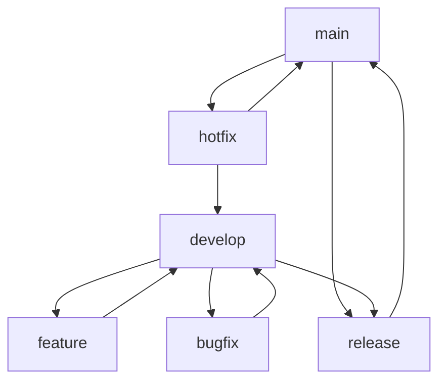

# Git Flow para Projeto — Nomeclatura das Branches

Este documento descreve o fluxo de trabalho Git Flow e as convenções de nomenclatura das branches para projetos.

---

## 1. Branch Principal
- **main**  
  Branch principal com o código de produção.

## 2. Branch de Desenvolvimento
- **develop**  
  Branch onde o desenvolvimento contínuo acontece antes de ir para produção.

## 3. Branches de Funcionalidade (Features)
- **feature/NOME-DESCRITIVO**  
  Para implementação de novas funcionalidades.  
  Exemplo: `feature/login-social`

## 4. Branches de Correção de Bugs (Hotfix)
- **hotfix/NOME-DESCRITIVO**  
  Para corrigir problemas críticos em produção.  
  Exemplo: `hotfix/corrige-erro-login`

## 5. Branches de Preparação de Release
- **release/VERSAO**  
  Para preparar uma nova versão para produção.  
  Exemplo: `release/1.2.0`

## 6. Branches de Correção durante Desenvolvimento (Bugfix)
- **bugfix/NOME-DESCRITIVO**  
  Para corrigir bugs encontrados durante o desenvolvimento.  
  Exemplo: `bugfix/ajusta-validação-email`

## 7. Branches de Experimentos (Experiment)
- **experiment/NOME-DESCRITIVO**  
  Para testes ou experimentos não planejados no roadmap.  
  Exemplo: `experiment/novo-layout-dashboard`

---

## Resumo Visual

---

## Recomendações

- **Sempre crie branches a partir de `develop` (exceto hotfix, que parte de `main`).**
- **Use nomes descritivos e curtos para facilitar o entendimento.**
- **Após finalizar uma branch de funcionalidade ou correção, faça o merge em `develop`.**
- **Releases e hotfixes devem ser integrados tanto em `main` quanto em `develop`.**

---